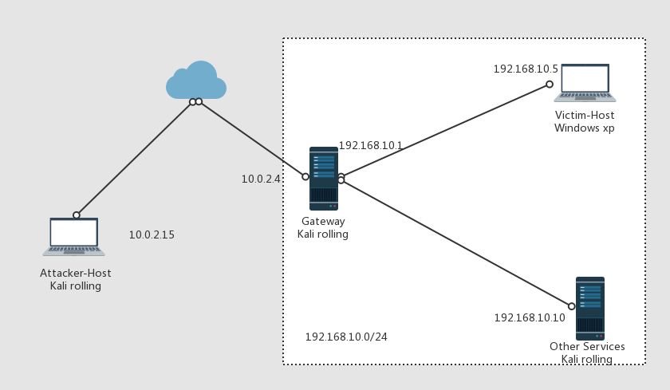

# 环境搭建  
  
## 系统要求及配置   
 
1. attacker-host(攻击者): kali-2017.1.64bits(增强功能安装方法)     
2. gateway(攻击者): kali-2017.1.64bits  镜像：[https://mirrors.tuna.tsinghua.edu.cn/kali-images/kali-2017.1/kali-linux-2017.1-amd64.iso](https://mirrors.tuna.tsinghua.edu.cn/kali-images/kali-2017.1/kali-linux-2017.1-amd64.iso)
3. victim-host(受害者)： windows xp sp3 32 bits 镜像：[https://sec.cuc.edu.cn/ftp/iso/zh-hans_windows_xp.iso](https://sec.cuc.edu.cn/ftp/iso/zh-hans_windows_xp.iso)  
4. 其他内网服务等 (例如 ftp  www 等) 拟采用 虚拟机 + docker的方式  ...   
  
## 网络环境与网络拓扑  
  
### 网络拓扑图：  

   
  
内部的局域网采用的是内部网络模式,暂时采用手工配置ip的方式。  
外网环境是采用nat网络来模拟的。   

在网关上进行如下操作(若重启网关需重复操作)：  
  
	iptables -t nat -A POSTROUTING -s 192.168.10.0/24 -o eth0 -j MASQUERADE 
	echo 1 > /proc/sys/net/ipv4/ip_forward   

实现内网可访问外网、互联网(暂时没有配DNS服务)，外网不可访问内网。  

### 路由：
网关上由于设置了双网卡，内网网卡会默认添加一个默认网关的路由，指向自身。  
修复方法：  

	route del default gw 192.168.10.1 dev eth1  
	route add default gw 10.0.2.4 dev eth0  

### dns服务 		
在网关的kali上面安装dnsmasp 

	apt-get install dnsmasq  
  
修改 /etc/resolv.conf    
修改为  
  
		nameserver 8.8.8.8
		nameserver 202.205.16.4     
  
分别对应google的dns服务和学校的dns服务。
重启dnsmasq(service dnsmasq restart)  
将对应的主机的dns server设置成192.168.10.1即可

### kali 2017 1 增强功能安装方法  
  
1. 确保 /etc/apt/sources.list中的记录为官方源 

		deb http://http.kali.org/kali kali-rolling main non-free contrib
 
2. 更新和下载所需软件
	
		apt-get update
		apt-get install linux-headers-4.9.0-kali4-all-amd64  
		apt-get install linux-image-4.9.0-kali4-amd64  
		apt-get install virtualbox-guest-x11     
 
	中间如果有error出错，尝试使用apt-get update --fix-missing 后再重复尝试安装  
 
3. 重启即可  

## bro的搭建  
1. 安装  

		apt-get install bro bro-aux  
2. 编辑 /etc/bro/site/local.bro，在文件尾部追加两行新配置代码并做把以下注释掉  

		# @load frameworks/files/extract-all-files
		@load frameworks/files/my_extract_files.bro
		@load mytuning.bro
	
3. 在/etc/bro/site/目录下创建新文件mytuning.bro， 添加：  

		redef ignore_checksums = T;  
4. 修改/etc/bro/networks.cfg中的监听网段  
	
		10.0.2.0/24	Private IP space
		192.168.10.0/24	Private IP space  
## 文件说明  
1. local.bro相当于主函数，调用其他的bro脚本  
2. networks.cfg配置broctl监控的网段  
3. my_extract_files.bro设置只提取doc、exe和rtf文件  
4. inotify.py监控文件夹/var/log/bro/current/extract_files/，若该文件夹中有新文件产生，就调用执行virustotal.py  
5. virustotal.py实现的是把文件上传至virustotal，并获取检测报告，判断是否为恶意软件  
6. config.sh开机运行此脚本，自动配置路由表、iptables和dnsmasq  
7. brotoiptables.py是监控/var/log/bro/current/notice.log，联动iptables针对恶意ip添加DROP的规则  
